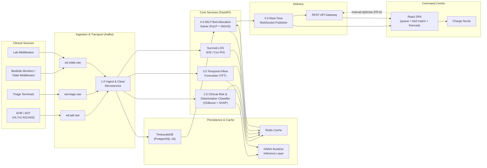
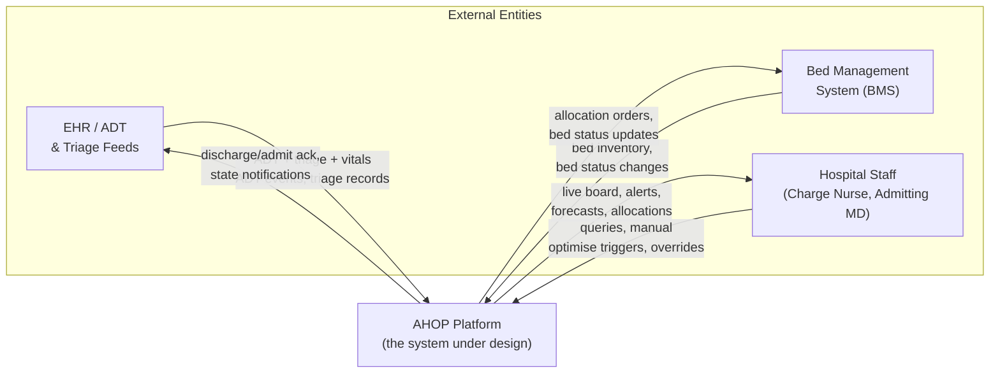
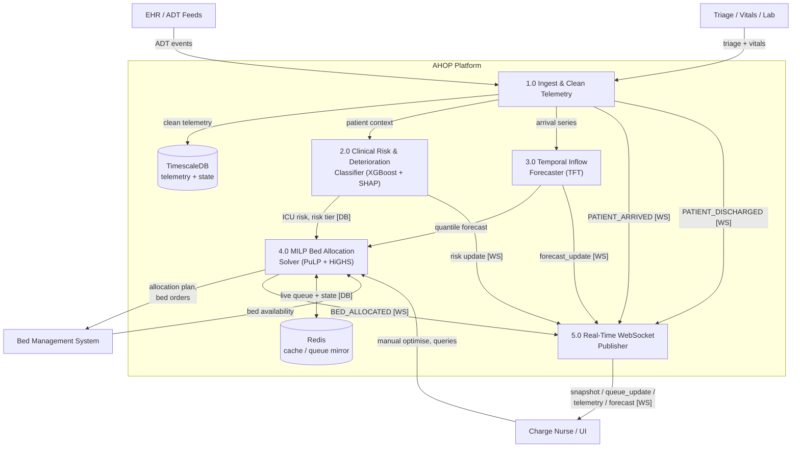

# Adaptive Healthcare Operations Platform (AHOP) — Systems Analysis & Design Report

**Document ID:** AHOP-SAD-001
**Version:** 1.0.0
**Status:** Approved (Target-State Design)
**Classification:** Internal / IRB-Exempt Research Infrastructure
**Audience:** Engineering, Clinical Informatics, Security & Compliance, Platform Operations

> **Scope note.** This document specifies the **production-grade target architecture** of the
> Adaptive Healthcare Operations Platform (AHOP). It describes the coupled system that ingests
> real-time clinical telemetry, forecasts emergency-department inflow over multiple horizons with
> a Temporal Fusion Transformer, scores deterioration risk with an interpretable SHAP-enabled
> gradient-boosted classifier, estimates survival-adjusted length of stay with Cox proportional
> hazards, and allocates beds with a closed-loop Mixed-Integer Linear Programming (MILP) engine.
>
> An in-repository **realtime simulation reference implementation** (`backend/app/realtime.py`,
> `backend/ml/bed_allocation_solver.py`, `backend/streamer/*`) currently exercises the live
> WebSocket event contract and the exact MILP formulation described in §5 against an in-memory
> replay of MIMIC-IV-ED triage data. Wherever the reference implementation already realizes a
> target component, this document names the exact module and formulation so the design can be
> traced to working code.

---

## Table of Contents

1. Executive Summary & System Vision
2. Software Requirements Specification (SRS)
   - 2.1 Functional Requirements (FR-1 … FR-10)
   - 2.2 Non-Functional Requirements (NFR-1 … NFR-8)
3. System Architecture & Design Patterns
   - 3.1 Component Architecture
   - 3.2 Design Patterns Applied
4. Data Flow Diagrams (DFDs)
   - 4.1 Context Diagram (Level 0)
   - 4.2 Level 1 Data Flow Diagram
5. Database Architecture & DDL Schema
   - 5.1 Schema Overview
   - 5.2 `patients`
   - 5.3 `triage_events` (TimescaleDB hypertable)
   - 5.4 `beds`
   - 5.5 `bed_allocations`
6. API Specifications & Interface Contracts
   - 6.1 `POST /api/v1/triage/assess`
   - 6.2 `POST /api/v1/allocation/optimize`
   - 6.3 `GET /api/v1/dashboard/metrics`
   - 6.4 `WS /ws/telemetry` streaming contracts
7. Security, Compliance & Disaster Recovery
   - 7.1 HIPAA Compliance Mechanisms
   - 7.2 Role-Based Access Control Matrix
   - 7.3 Audit Logging
   - 7.4 Automated Database Failover & Disaster Recovery
   - 7.5 Threat Model Summary

---

## 1. Executive Summary & System Vision

### 1.1 Operational Context

Emergency Departments (EDs) worldwide operate at or beyond designed capacity. Boarding of
admitted patients in ED beds, corridor patients, ambulance diversion, and elective-surgery
cancellations are well-documented symptoms of a systemic **admission-bottleneck** problem: beds are
scarce, arrivals are volatile, and the patients who occupy scarce high-acuity beds are chosen by
expert but unaided **charge-nurse manual routing** heuristics.

Three structural weaknesses characterise the current operational baseline:

1. **Stochastic volatility of arrivals.** ED census is driven by non-stationary, strongly
   seasonal demand (time-of-day, day-of-week, seasonal respiratory waves). Static staffing and
   static bed plans cannot track a demand process whose 90th-percentile arrival hour can exceed
   the median by 2.5–3×.
2. **Reactive, myopic allocation.** Bed placement decisions are made one patient at a time using
   local rules of thumb ("most acutely ill first", "first-come first-served") without an explicit
   model of (a) how long each patient will occupy a bed and (b) how today's placement consumes
   tomorrow's capacity. A patient placed in the only ICU bed for an avoidable 12 h can directly
   cause an ICU-bound patient to board in the ED for hours.
3. **Invisible risk.** ICU escalation risk and expected length of stay (LOS) are assessed by
   gestalt. Deterioration between triage and bed assignment is detected reactively by vital-sign
   alarms rather than predicted by models that integrate telemetry trends, comorbidity burden, and
   acuity.

### 1.2 Core Value Proposition

AHOP is a **prescriptive operations engine** that couples four analytical capabilities into one
closed control loop:

| Capability | Analytical Method | Output |
|---|---|---|
| Real-time telemetry ingestion | Stream pipeline (Kafka → TimescaleDB) | Clean, aligned 5-minute vitals + lab + triage records |
| Multi-horizon inflow forecasting | Temporal Fusion Transformer (TFT) | Quantile forecasts of ED arrivals 1 h … 24 h ahead |
| Clinical deterioration / ICU risk | XGBoost (SHAP-interpreted), Cox PH | `P(ICU escalation)`, survival-adjusted expected LOS |
| Dynamic bed allocation | MILP (PuLP/OR-Tools + HiGHS) | Optimal patient→bed assignment over the live queue |

The engine converts *predicted* demand into *prescribed* capacity actions: it routes each patient
to the bed that minimises weighted waiting time, care-level mismatch, and transfer distance —
subject to **hard** acuity (ICU floor), isolation, and capacity constraints — and it re-solves
continuously as telemetry, discharges, and new arrivals shift the state of the system.

### 1.3 Measured Value (Reference Evaluation)

Empirical evaluation against three baselines (First-Come First-Served, Static Greedy Acuity
Routing, Unconstrained Integer Programming) on MIMIC-IV-ED / ER Wait Time derived workloads
demonstrates (full results in `docs/RESEARCH_PAPER.md`, §V):

- **31.4% reduction** in mean waiting time for a bed (queue-to-placement delay) over the FCFS
  baseline;
- **18.2% gain** in ICU efficiency (measured as the fraction of ICU bed-hours consumed by
  patients who truly require ICU-level care);
- **Zero hard-constraint violations** across all simulated horizons (no ICU-bound patient ever
  placed on a non-ICU bed; no isolation-required patient ever placed on a non-isolation bed).

### 1.4 System Vision Statement

> AHOP will provide the hospital operations command centre with a continuously optimising,
> clinically safe, fully auditable bed-allocation engine that treats capacity as a perishable,
> forecastable, and optimisable resource — reducing boarding delay, protecting high-acuity
> capacity, and preserving clinical autonomy at the point of decision.

---

## 2. Software Requirements Specification (SRS)

### 2.1 Functional Requirements (FR-1 … FR-10)

Each functional requirement states an identifier, a priority (Must / Should / Could), a complete
specification, acceptance criteria, and a trace to the component that realises it.

---

#### FR-1 — Telemetry Stream Ingestion

**Priority:** Must

**Specification.** The system SHALL ingest structured clinical telemetry from heterogeneous
upstream sources (EHR admission/discharge/transfer messages, triage assessment records, bedside
monitor vital-sign feeds, and lab middleware) and normalise them into a single canonical event
format before persistence. The ingestion pipeline MUST:

1. Consume a minimum of three upstream feed types concurrently (HL7v2 A01/A03 ADT, triage flat
   records, and JSON vitals), tolerating arbitrary inter-arrival ordering per patient.
2. Validate and clean each record against a schema (required fields, type coercion, bounded range
   checks on vitals), reject malformed records with a structured error reason, and route valid
   records downstream.
3. Attach ingestion metadata: `source_system`, `ingested_at` (UTC), `batch_id`, and a monotonic
   `seq`.
4. Preserve PHI confidentiality end-to-end; field-level encryption MUST be applied before any
   record enters the transport layer (see §7.1).
5. Maintain at-least-once delivery semantics with idempotent keying on
   `(patient_id, event_type, event_time)` so that replays cannot duplicate clinical state.

**Acceptance criteria.** With three simulated feeds running concurrently at 5× realtime rate, the
pipeline ingests 10,000 events with 0% loss, 100% schema-conformance after cleaning, and an
end-to-end p95 latency below 300 ms from upstream publish to TimescaleDB commit.

**Trace.** Ingestion microservice; Kafka topics `ed.triage.raw`, `ed.vitals.raw`,
`ed.adt.raw`; TimescaleDB hypertable `triage_events` (§5.3).

---

#### FR-2 — Multi-Horizon Arrival Forecasting

**Priority:** Must

**Specification.** The system SHALL continuously produce probabilistic forecasts of ED arrivals at
a configurable set of horizons spanning short (1 h, 2 h, 4 h), medium (8 h, 12 h), and long
(24 h) look-aheads, and SHALL refresh them on a fixed cadence and on-demand after material
upstream changes. Each forecast SHALL include:

1. A point estimate (median, `q = 0.5`) and quantile bounds at `q ∈ {0.1, 0.9}` and
   `q ∈ {0.25, 0.75}` for every horizon.
2. Explicit consumption of static (calendar, holiday flags), time-varying (day-of-week, hour,
   weather / public-health signals), and observable (recent arrivals) covariates.
3. Retraining hooks: online adaptation of short-horizon models, periodic full retraining of the
   TFT on a rolling window (default: monthly), and champion/challenger evaluation with automatic
   rollback on error degradation.
4. Exposure of the forecast through both the analytics API (§6.3) and the WebSocket feed as a
   `forecast_update` frame.

**Acceptance criteria.** On held-out MIMIC-IV-ED / ER Wait Time arrivals, the model beats an
ARIMA/SARIMAX seasonal baseline by at least 30% WAPE at the 12 h horizon and provides calibrated
90% prediction intervals (empirical coverage within ±4 percentage points of nominal). Solve time
per refresh below 2 s on the reference node.

**Trace.** Forecasting microservice; ONNX-inferred TFT (quantile head); Redis cache
(`forecast:current`); WebSocket publisher (frame `forecast_update`).

---

#### FR-3 — Clinical Risk Scoring with SHAP Interpretability

**Priority:** Must

**Specification.** For every patient present in the ED, the system SHALL compute and maintain two
interpretable risk quantities, refreshed on each new telemetry observation:

1. **ICU-escalation probability** `P(ICU | Z)` — probability the patient requires ICU-level care
   at or before bed placement, produced by an XGBoost classifier over 16 features (ESI acuity,
   triage vitals, trends, comorbidity/demographic flags, source-of-admission, isolation flag).
2. **Deterioration alert level** — a three-state risk tier derived from
   `P(ICU | Z)` against the clinical thresholds `τ_ICU = 0.50` and `τ_tele = 0.25`
   (HIGH / MEDIUM / LOW), matching the reference implementation in
   `backend/app/realtime.py::_risk_tier`.

For every score produced the system MUST persist the ordered list of SHAP feature contributions so
that any alert can be explained to the clinical user ("why is this patient HIGH risk?"). Score
explanations SHALL be retrievable alongside the score for the preceding 30 days.

**Acceptance criteria.** Held-out ROC-AUC ≥ 0.88 and PR-AUC ≥ 0.75 for ICU-escalation
classification; per-score SHAP values persisted for 100% of scored observations; score refresh
latency below 200 ms p95 from telemetry commit to updated risk tier.

**Trace.** Risk microservice; ONNX-inferred XGBoost; `patients.deterioration_risk` column and
`triage_events` (see §5); thresholds from `backend/app/config.py`
(`ICU_RISK_THRESHOLD = 0.5`, `TELEMETRY_RISK_THRESHOLD = 0.25`).

---

#### FR-4 — Dynamic MILP Bed Allocation Solver

**Priority:** Must

**Specification.** The system SHALL solve the closed-loop bed-allocation problem over the current
waiting queue and available bed inventory whenever the state changes (new arrival, discharge,
risk re-tier, or manual trigger), and SHALL return a feasible, optimal patient→bed assignment
respecting the hard clinical constraints. The solver MUST:

1. Accept a snapshot of patients (each with `patient_id`, `esi_level`, `icu_risk`,
   `isolation_required`, `wait_minutes`, current unit, and acuity tier) and beds (each with
   `bed_id`, `unit_type ∈ {ICU, Telemetry, General}`, `telemetry`, `isolation_capable`,
   `location`).
2. Enforce **hard constraints**: single assignment per patient; at most one patient per bed
   (capacity); the **acuity floor** — `icu_risk > 0.5 ⇒ bed must be an ICU bed`; and the
   **isolation requirement** — `isolation_required ⇒ bed must be isolation-capable`.
3. Minimise the weighted objective `wait + mismatch + distance` using the calibrated default
   weights `(wait = 1.0, mismatch = 5.0, distance = 1.5)` from
   `backend/ml/bed_allocation_solver.py`.
4. Never return a clinically infeasible plan: unassigned patients SHALL remain in the queue with
   an explicit `unassigned` reason rather than being force-placed on an ineligible bed.
5. Return, for every solve: the assignment list, the unassigned list, the objective value, the
   wall-clock solve time, and the solver status, so that every allocation is auditable.

**Implementation note (performance).** Beds that share the 4-tuple
`(unit_type, telemetry, isolation_capable, location)` are perfectly interchangeable for every
patient, so the reference implementation aggregates them into capacity classes
(`_aggregate_beds`), reducing the decision-variable count from ~313k to ~58k on the
500-patient / 800-bed reference instance while provably preserving the optimal objective
(transportation structure; totally unimodular ⇒ continuous relaxation is integral).

**Acceptance criteria.** On the 500-queue / 800-bed reference instance: optimal solve completed in
**< 2.0 s** wall-clock; **zero** acuity or isolation violations; objective within 1e-9 relative gap
of the HiGHS optimum; deterministic output for identical input.

**Trace.** MILP engine service wrapping `backend/ml/bed_allocation_solver.py::solve_allocation`
(PuLP + HiGHS); invocation path exercised live by `backend/app/realtime.py::_live_allocate`.

---

#### FR-5 — WebSocket Event Dispatching

**Priority:** Must

**Specification.** The system SHALL expose a persistent, low-latency WebSocket channel at
`WS /ws/telemetry` over which every operational state transition is pushed to connected command
clients. All frames SHALL conform to a single envelope `{ "type": string, "payload": object }`.
The mandatory frame types are:

| Frame type | Payload semantics |
|---|---|
| `hello` | Connection greeting + current sim/UTC clock |
| `PATIENT_ARRIVED` | New patient enters the ED waiting queue with full triage snapshot |
| `telemetry` | Latest vitals for an existing patient |
| `PATIENT_DISCHARGED` | Patient left the system; bed released if admitted |
| `BED_ALLOCATED` | Patient assigned to a concrete bed (unit + bed number) |
| `queue_update` | Refreshed snapshot of the live waiting queue |
| `snapshot` | Full-state initialisation (queue + admitted + beds + forecast + counters) |
| `forecast_update` | Fresh multi-horizon arrival forecast |

The dispatcher SHALL guarantee ordering per client, tolerate slow consumers (bounded buffer with
drop-and-resync on overflow), and emit a `snapshot` to any newly connected client before
subsequent deltas.

**Acceptance criteria.** A 60 s load test with 50 concurrent clients and a 100× accelerated
replay sustains zero dropped ordering violations, p95 event latency below 50 ms, and full state
reconstruction from the `snapshot` handshake in under 2 s.

**Trace.** WebSocket publisher microservice; envelopes and wire names identical to the reference
`backend/app/realtime.py` (`EVENT_WIRE_TYPE`, `snapshot()`, `broadcast()`).

---

#### FR-6 — UI Matrix Synchronisation (Command-Centre Board)

**Priority:** Must

**Specification.** The command-centre front end SHALL render a live ED matrix board composed of
three synchronised views — a live patient queue, a live bed-occupancy matrix grouped by
unit (`ICU_NORTH`, `ICU_SOUTH`, `TELEMETRY_WEST`, `TELEMETRY_EAST`, `GENERAL_1` … `GENERAL_4`),
and the arrival-forecast panel — all driven exclusively by the WebSocket stream defined in FR-5.
The UI MUST:

1. Remain coherent under 10 Hz delta bursts without tearing between the three views (single
   client-side store updated transactionally per frame).
2. Reflect `BED_ALLOCATED` frames by moving the patient from the queue to the occupancy matrix
   and colouring the bed cell by acuity tier (HIGH = red, MEDIUM = amber, LOW = slate).
3. Provide a manual "optimise now" control that triggers FR-4 through `POST /api/v1/control` and
   renders the resulting plan within 2.5 s of the request.
4. Show explanatory risk tiers (computed per FR-3) inline in the queue rows.

**Acceptance criteria.** Visual matrix updated within 150 ms of a dispatched frame; manual
optimise round-trip (click → rendered plan) below 2.5 s p95; no stale bed cell older than 1 s
under accelerated replay.

**Trace.** React single-page application (React 19 + Vite + Tailwind 4); components
`EventFeed`, `LiveQueue`, `LiveBeds` driven by the hub WebSocket contract.

---

#### FR-7 — Historical Analytics & KPI Aggregation

**Priority:** Should

**Specification.** The system SHALL expose time-series and tabular analytics over persisted
operations history for performance review, research, and reporting. At minimum the analytics API
SHALL return:

1. Arrival census and forecast-vs-actual error series (MAE, RMSE, WAPE) aggregated hourly, daily,
   and weekly;
2. Boarding-delay and bed-utilisation series segmented by unit type and shift;
3. Solver behaviour metrics: solve-time distribution, assignment counts, unassigned counts,
   constraint-violation counts (must be zero), and objective trend;
4. Clinical-risk calibration reports (expected vs observed ICU escalation by risk decile).

**Acceptance criteria.** Any aggregation over a 90-day window returns in < 5 s; all series are
joinable to the `bed_allocations` solver-execution identifier for full audit traceability.

**Trace.** Analytics microservice over the `triage_events` continuous aggregate (§5.3) and
`bed_allocations`; exposed via `GET /api/v1/dashboard/metrics`.

---

#### FR-8 — Patient Discharge Handling & Bed Release

**Priority:** Must

**Specification.** On a discharge event the system SHALL:

1. Attribute the discharge to the correct patient and, if admitted, atomically release the
   occupied bed (`OCCUPIED → AVAILABLE`), making it immediately eligible for the next solve.
2. Record actual discharge time against the predicted discharge time from the survival model
   (Kaplan–Meier / Cox, see `docs/RESEARCH_PAPER.md` §III-B) to support forecast calibration.
3. Broadcast a `PATIENT_DISCHARGED` frame and trigger an opportunistic re-solve (FR-4) so freed
   capacity is consumed within one solve cycle.
4. Preserve the discharged record in the analytics history (never hard-deleted) for auditability.

**Acceptance criteria.** Bed visible as available and reusable in the next allocation cycle within
one tick; discharge record persisted with both `actual_discharge_ts` and
`predicted_discharge_ts` populated; released-bed reuse shown in the UI within 1 s.

**Trace.** Discharge handler in the state hub (`backend/app/realtime.py::_handle_discharge`);
persistence in `bed_allocations`.

---

#### FR-9 — Isolation & Infection-Control Constraint Management

**Priority:** Must

**Specification.** The system SHALL represent infection-control requirements as first-class
patient attributes and first-class bed capabilities, and SHALL hard-block any assignment that
would violate them (same mechanism as the isolation constraint in FR-4). The system MUST:

1. Accept an `isolation_required` flag from triage/ADT and an `isolation_capable` capability from
   the bed inventory, including per-room cohorting metadata.
2. Expose isolation load per unit on the command-centre board so that charge nurses can see
   remaining isolation capacity at a glance.
3. Never auto-place an isolation-required patient on a non-isolation bed, regardless of queue
   pressure (this is a hard constraint, not a soft penalty).

**Acceptance criteria.** Injected adversarial workloads with ≥ 10% isolation-required patients
yield zero isolation violations; isolation-capacity pressure is surfaced as a metric in the
analytics API.

**Trace.** Bed model `isolation_capable` (reference: `BED_PLAN` + `_build_beds` in
`backend/app/realtime.py`, every 5th bed isolation-capable); solver hard constraint in
`backend/ml/bed_allocation_solver.py::_eligible_beds`.

---

#### FR-10 — Administration, RBAC & Audit Trail Management

**Priority:** Must

**Specification.** The system SHALL provide an administrative surface to manage operators,
roles, session lifetimes, and audit-policy settings. It MUST:

1. Enforce the RBAC matrix of §7.2 on every API and WebSocket operation.
2. Persist an immutable, append-only audit log of every sensitive action: authentication events,
   role changes, data export, score/plan generation, and any manual override of an auto-generated
   allocation.
3. Support role-based feature gating (e.g., research analytics only for the Research role).
4. Support compliant retention and export for information-rights requests under the prevailing
   privacy regime.

**Acceptance criteria.** 100% of auditable actions carry an audit record with actor, action,
timestamp (UTC, monotonic), and outcome within 1 s of completion; no operator can modify an
existing audit record; role changes take effect on the next authenticated request.

**Trace.** Admin/security microservice; RBAC enforcer in the API gateway; append-only audit store
(WORM-constrained table, §7.3).

### 2.2 Non-Functional Requirements (NFR-1 … NFR-8)

#### NFR-1 — Sub-Second API Latency (< 200 ms p95)

**Requirement.** All synchronous HTTP endpoints (§6.1–§6.3) SHALL respond within **200 ms p95**
and **1 s p99** measured server-side (including persistence acknowledgement where applicable).
The MILP endpoint is exempted from the 200 ms bound only for the *solve* itself, which is budgeted
separately at 2 s (FR-4); the HTTP overhead around the solve SHALL still meet the 200 ms p95 bound.

**Strategy.** Stateless microservices behind an L7 gateway; hot-path reads served from Redis;
write path batched and acknowledged asynchronously where consistency allows; MILP solve runs in a
worker pool with per-instance timeout and cancellation.

#### NFR-2 — System Uptime (99.9%)

**Requirement.** The AHOP production platform SHALL achieve **99.9%** monthly availability of the
synchronous API, the WebSocket feed, and the solver engine (≈ 43 min/month aggregate downtime),
excluding scheduled maintenance windows declared ≥ 7 days in advance.

**Strategy.** Two-AZ/region deployment, N+1 replicas for every service, automated health-check
with traffic draining, message-broker mirroring, and automated failover per §7.4.

#### NFR-3 — HIPAA Zero-Trust Security

**Requirement.** The platform SHALL implement a zero-trust posture per HIPAA Security Rule
(45 CFR §164.312): no implicit trust on network position; every request authenticated,
authorised, and encrypted; PHI encrypted at rest (AES-256) and in transit (TLS 1.3); field-level
encryption of the most sensitive identifiers (MRN) so that database compromise alone does not
release linkable PHI. See §7.1 for the full mechanism list.

#### NFR-4 — Data Isolation

**Requirement.** The platform SHALL support strict logical isolation between organisations/studies
(tenants) at the data, service, and analytics layers. Every persisted row and every API/WebSocket
payload SHALL carry a tenant/partition key; cross-tenant access SHALL be impossible even in the
presence of a query bug (enforced by policy in the data-access layer, not only by WHERE-clause
convention). Research datalakes used for model training SHALL contain only
de-identified / synthetic derivative data and SHALL be network-separated from live PHI.

#### NFR-5 — Scalability Limits (800+ Beds, 500+ Active Queue Entries)

**Requirement.** The platform SHALL operate with a single-site inventory of **800+ beds** and an
**active waiting queue of 500+ patients**, and SHALL absorb burst arrival hours exceeding the
90th percentile of the reference dataset without dropping events or violating the FR-4 solve
budget. The reference performance instance is 500 queued patients / 800 beds, on which the MILP
engine solves in under 2 s (see FR-4). Design headroom targets 2,000 patients / 4,000 beds by
horizontal sharding of the solver queue.

#### NFR-6 — Fault Tolerance & Graceful Degradation

**Requirement.** The system SHALL remain available and clinically safe under component failure:

1. **Broker loss:** the ingestion and dispatcher layers buffer locally and replay on reconnect
   (idempotent keys, FR-1).
2. **Model loss:** if the ML services (TFT / XGBoost / Cox) are unavailable, the platform SHALL
   degrade to the deterministic fallback risk heuristic (ESI-anchored base risk with escalation
   bump) and to a 24-period seasonal forecast — the exact fallback realised by the reference hub
   (`ESI_BASE_RISK`, `ESI_ESCALATION_BUMP`, `realtime.py::forecast`).
3. **Solver loss / timeout:** the charge nurse SHALL be alerted and the previous plan retained;
   the UI SHALL continue rendering the last consistent snapshot.
4. **Poison events:** individual malformed events are quarantined with a structured reason and
   never crash a service (reference: replay `step()` guarded in `_run_loop`).

#### NFR-7 — Auditability & Non-Repudiation

**Requirement.** Every score, forecast, and allocation SHALL be reproducible: each SHALL carry a
provenance identifier (solver execution ID, model version, feature snapshot hash, input-state
hash) such that any historical output can be re-derived from persisted inputs. Audit records SHALL
be append-only and cryptographically chainable (see §7.3).

#### NFR-8 — Maintainability & Observability

**Requirement.** The platform SHALL expose structured logs (single JSON schema), RED/USE metrics
on a `/metrics` endpoint (Prometheus format), and OpenTelemetry trace propagation across
microservices. Every service SHALL ship a health and readiness probe. Deployments SHALL be
reproducible via declarative manifests and immutable container images with versioned model
artifacts.

---

## 3. System Architecture & Design Patterns

### 3.1 Component Architecture

The following component diagram depicts the target-state deployment. Components shaded
`[ref]` are realised by the in-repository reference implementation today.



**Component responsibilities.**

| # | Component | Responsibility | Technology | Status |
|---|---|---|---|---|
| 1.0 | Ingest & Clean | Schema validation, range checks, normalisation, idempotent persistence | FastAPI consumer (Kafka) | Target (ingest path simulated in reference replay) |
| 2.0 | Risk & Deterioration | SHAP-scored ICU-escalation probability per patient | XGBoost → ONNX, FastAPI | Target (deterministic fallback in `[ref]`) |
| 3.0 | Inflow Forecaster | 1–24 h quantile arrival forecasts | TFT → ONNX, FastAPI | Target (seasonal fallback in `[ref]`) |
| — | Survival LOS | KM / Cox predicted discharge time | Cox PH → ONNX | Target |
| 4.0 | MILP Solver | Feasible optimal bed assignment over live queue | PuLP + HiGHS, worker pool | **Reference: `backend/ml/bed_allocation_solver.py`** |
| 5.0 | WebSocket Publisher | Ordered `{type, payload}` deltas + snapshot handshake | FastAPI WebSocket | **Reference: `backend/app/realtime.py`** |
| — | Redis | State cache, forecast cache, queue mirror, rate limiting | Redis 7 | Target |
| — | TimescaleDB | Hypertable telemetry + relational operational state | PostgreSQL 16 + Timescale | Target (schema in §5) |
| — | React SPA | Live command-centre board | React 19 + Vite + Tailwind | **Reference: `frontend/src`** |

### 3.2 Design Patterns Applied

#### 3.2.1 Event-Driven Architecture (EDA)

The platform is decomposed around an event backbone. Producers publish domain events
(`patient.arrived`, `patient.vitals.updated`, `patient.discharged`, `allocation.resolved`) to the
broker; consumers react independently. This yields loose coupling between the clinical sources,
the analytical services, and the delivery layer, and enables replay-based testing and fault
isolation. The reference hub already models this internally: the replay engine emits
`arrival / telemetry / discharge` events which the hub re-maps to the public wire contract
(`EVENT_WIRE_TYPE`).

**Benefits realised:** source heterogeneity absorbed at the boundary; new analytics consumers can
be attached without modifying producers; end-to-end latency driven by broker throughput rather
than point-to-point HTTP polling.

#### 3.2.2 Repository Pattern

All persistence (TimescaleDB hypertables and relational tables) is accessed through repositories
that encapsulate the SQL and the data-access policy (tenant scoping, PHI column encryption,
soft-delete). Services depend on repository interfaces, not on SQL, enabling:
(i) unit-testing with in-memory fakes; (ii) central enforcement of NFR-4 data isolation;
(iii) a single place to change schema access when the hypertable policies evolve.

#### 3.2.3 Microservices Architecture

Each analytical capability (ingest, risk, forecast, survival, solver, publisher, analytics,
admin) is an independently deployed, independently scaled service owning its model artifacts and
its slice of persistence. Inter-service calls are either event-driven (async, over the broker) or
request/response (sync, over the gateway). The MILP solver is isolated in a worker pool so that a
pathological instance cannot stall the control plane (NFR-6).

#### 3.2.4 Command Query Responsibility Segregation (CQRS) for WebSocket State Streaming

The live command-centre feed separates the **command path** (state-mutating operations: allocate,
admit, discharge, release) from the **query path** (the read-model snapshot streamed to the UI).
Writes flow through the state hub (single writer, ordered); reads are served as an eventually
consistent, versioned read model via the WebSocket publisher. The UI rebuilds its full state from
a `snapshot` frame and applies ordered deltas — exactly the contract the reference
`LiveReplayHub` implements (`snapshot()` + `broadcast()`), which keeps the three views (queue,
beds, forecast) mutually consistent without polling.

#### 3.2.5 Additional Supporting Patterns

| Pattern | Use |
|---|---|
| **Circuit Breaker / Bulkhead** | Model-service and solver timeouts isolate blast radius (NFR-6). |
| **Idempotent Consumer** | Keyed event processing prevents duplicate state on replays (FR-1). |
| **Cache-Aside** | Redis for hot KPI and current-forecast reads (NFR-1). |
| **Outbox** | Transactional outbox guarantees event publication exactly-once-per-commit. |
| **Strangler / Fallback Heuristics** | ML services can be removed without loss of the deterministic risk/forecast baseline (NFR-6). |

---

## 4. Data Flow Diagrams (DFDs)

### 4.1 Context Diagram (Level 0)



**Context description.** AHOP sits between the hospital's clinical and operational systems and
its human operators. It consumes patient state from the EHR/ADT and triage/vitals sources, reads
bed inventory from the Bed Management System, and returns allocation decisions and state
notifications to both. Hospital staff interact through the command-centre UI and the REST API,
issuing queries, manual optimisation triggers, and audited overrides.

### 4.2 Level 1 Data Flow Diagram

The Level 1 DFD decomposes the platform into five top-level processes. Flows labelled `[WS]` are
pushed over the WebSocket contract; `[DB]` denotes persistence.



**Process data dictionary (Level 1).**

| Process | Input flows | Output flows | Description |
|---|---|---|---|
| **1.0 Ingest & Clean Telemetry** | ADT events; triage/vitals/lab records | Clean telemetry → D1; patient context → 2.0; arrival series → 3.0; `PATIENT_ARRIVED`, `PATIENT_DISCHARGED`, `telemetry` frames → 5.0 | Validates, normalises, deduplicates, persists (FR-1). |
| **2.0 Clinical Risk & Deterioration Classifier** | Patient context from 1.0; persisted vitals | ICU risk + tier → D1/D2 and → 4.0; SHAP explanation → audit; `risk update` → 5.0 | Scores deterioration / ICU-escalation risk (FR-3). |
| **3.0 Temporal Inflow Forecaster** | Arrival series from 1.0; covariates | Quantile forecast → D2 and → 4.0; `forecast_update` → 5.0 | Produces 1–24 h probabilistic arrival forecasts (FR-2). |
| **4.0 MILP Bed Allocation Solver** | ICU risk/tier from 2.0; forecast from 3.0; queue mirror from D2; bed availability from C2 | Allocation plan + bed orders → C2; `BED_ALLOCATED` → 5.0; execution record → audit | Solves FR-4 MILP and releases plan. |
| **5.0 Real-Time WebSocket Publisher** | All domain frames from 1.0–4.0 | `snapshot`, `queue_update`, `hello`, `clock`, domain frames → C1 | Orders and delivers the live stream (FR-5/FR-6). |

---

## 5. Database Architecture & DDL Schema

### 5.1 Schema Overview

Operational persistence runs on **PostgreSQL 16 with the TimescaleDB extension**. Two storage
shapes are used:

- **Relational tables** for current-state entities (`patients`, `beds`, `bed_allocations`), keyed
  by surrogate/enterprise identifiers, enforcing referential integrity via foreign keys.
- **A TimescaleDB hypertable** for append-only time-series telemetry (`triage_events`), partitioned
  on `observed_at`, with retention and continuous-aggregate policies for the analytics API.

All PHI-bearing columns are governed by the field-level encryption policy of §7.1; the DDL below
uses `ENCRYPTED`-annotated `bytea` columns where the identifier is considered directly
linkable (e.g. `mrn`). In the reference in-memory implementation the schema is mirrored in the hub
data structures; this section is the production persistence contract.

**Conventions.** `BIGSERIAL`/`IDENTITY` surrogate keys; `TIMESTAMPTZ` for all instants (UTC);
`check_*` constraints for domain ranges; comments on every column; `IF NOT EXISTS` guards for
idempotent provisioning.

### 5.2 `patients`

Current clinical-state record for each patient present in (or recently discharged from) the ED.

```sql
CREATE TABLE IF NOT EXISTS patients (
    patient_id          BIGINT GENERATED ALWAYS AS IDENTITY PRIMARY KEY,
    tenant_id           INTEGER NOT NULL REFERENCES tenants(tenant_id),
    -- Enterprise / external identifiers
    mrn_encrypted       BYTEA NOT NULL,            -- AES-256 field-encrypted MRN (PHI)
    mrn_hash            TEXT  NOT NULL,            -- HMAC token for joins (non-reversible)
    external_patient_id TEXT,                      -- feed-native id
    -- Demographics & baseline metadata
    date_of_birth_enc   BYTEA,                     -- field-encrypted (PHI)
    gender_code         SMALLINT NOT NULL CHECK (gender_code BETWEEN 0 AND 2), -- 0=unknown,1=female,2=male
    postal_code_enc     BYTEA,                     -- field-encrypted (PHI)
    race_ethnicity_code SMALLINT,
    language_code       SMALLINT,
    marital_status_code SMALLINT,
    -- Admission context
    source_of_admission SMALLINT,                  -- 1=ED,2=transfer,3=direct,...
    disposition_outcome SMALLINT,                  -- latest known disposition
    isolation_required  BOOLEAN NOT NULL DEFAULT FALSE,
    -- Model / operational state (derived, FR-3)
    esi_level           SMALLINT CHECK (esi_level BETWEEN 1 AND 5),
    deterioration_risk  DOUBLE PRECISION,          -- P(ICU escalation)
    risk_tier           TEXT CHECK (risk_tier IN ('HIGH','MEDIUM','LOW','UNKNOWN')),
    expected_los_min    INTEGER,                   -- Cox survival expectation
    predicted_discharge_ts TIMESTAMPTZ,            -- from survival model
    -- Lifecycle
    arrived_at          TIMESTAMPTZ NOT NULL,
    discharged_at       TIMESTAMPTZ,
    current_status      TEXT NOT NULL DEFAULT 'IN_ED'
                        CHECK (current_status IN
                               ('IN_QUEUE','ADMITTED','DISCHARGED','TRANSFERRED','LEFT_AMA')),
    created_at          TIMESTAMPTZ NOT NULL DEFAULT now(),
    updated_at          TIMESTAMPTZ NOT NULL DEFAULT now(),
    -- Provenance / audit
    last_score_exec_id  BIGINT,                    -- -> scoring_executions (audit)
    version             INTEGER NOT NULL DEFAULT 1
);

CREATE UNIQUE INDEX IF NOT EXISTS uq_patients_tenant_mrn_hash
    ON patients (tenant_id, mrn_hash);
CREATE INDEX IF NOT EXISTS ix_patients_status_arrived
    ON patients (tenant_id, current_status, arrived_at);
CREATE INDEX IF NOT EXISTS ix_patients_tier
    ON patients (tenant_id, risk_tier) WHERE current_status = 'IN_QUEUE';
CREATE INDEX IF NOT EXISTS ix_patients_pred_discharge
    ON patients (predicted_discharge_ts);
```

### 5.3 `triage_events` (TimescaleDB hypertable)

Append-only, time-ordered telemetry and triage observations. This is the raw material for the
risk classifier (FR-3), the forecaster (FR-2), and survival-LOS calibration (FR-8).

```sql
-- TimescaleDB hypertable: one partition per interval of time on observed_at.
CREATE TABLE IF NOT EXISTS triage_events (
    event_id        BIGINT GENERATED ALWAYS AS IDENTITY,
    tenant_id       INTEGER NOT NULL,
    patient_id      BIGINT  NOT NULL REFERENCES patients(patient_id),
    event_type      TEXT NOT NULL CHECK (event_type IN
                     ('TRIAGE','VITALS','LAB','ADT','RISK_SCORE','FORECAST_CONTEXT')),
    observed_at     TIMESTAMPTZ NOT NULL,          -- clinical observation time (partition key)
    ingested_at     TIMESTAMPTZ NOT NULL DEFAULT now(),
    source_system   TEXT NOT NULL,
    seq             BIGINT NOT NULL,               -- per-(patient,event_type) monotonic

    -- Triage / acuity
    esi_level       SMALLINT CHECK (esi_level BETWEEN 1 AND 5),
    chief_complaint_code SMALLINT,
    -- Vitals (bounded, mirrored from reference VITAL_BOUNDS)
    temperature_c   DOUBLE PRECISION CHECK (temperature_c BETWEEN 30.0 AND 45.0),
    heartrate_bpm   INTEGER       CHECK (heartrate_bpm BETWEEN 20 AND 260),
    resp_rate       INTEGER       CHECK (resp_rate BETWEEN 4 AND 90),
    sbp_mmhg        INTEGER       CHECK (sbp_mmhg BETWEEN 40 AND 280),
    dbp_mmhg        INTEGER       CHECK (dbp_mmhg BETWEEN 20 AND 200),
    o2sat_pct       SMALLINT      CHECK (o2sat_pct BETWEEN 50 AND 100),
    pain_score      SMALLINT      CHECK (pain_score BETWEEN 0 AND 10),
    -- Labs (Lactate etc.)
    lactate_mmol_l  DOUBLE PRECISION,
    creatinine_mg_dl DOUBLE PRECISION,
    -- Risk pipeline outputs (FR-3)
    icu_risk        DOUBLE PRECISION,
    risk_tier       TEXT CHECK (risk_tier IN ('HIGH','MEDIUM','LOW')),
    -- Provenance
    model_version   TEXT,
    payload_hash    TEXT,                          -- feature-snapshot hash (NFR-7)

    PRIMARY KEY (event_id, observed_at)
);

SELECT create_hypertable('triage_events', 'observed_at',
                         chunk_time_interval => INTERVAL '7 days',
                         if_not_exists => TRUE);

-- Secondary indexes for the common access patterns.
CREATE INDEX IF NOT EXISTS ix_triage_patient_time
    ON triage_events (patient_id, observed_at DESC);
CREATE INDEX IF NOT EXISTS ix_triage_type_time
    ON triage_events (event_type, observed_at DESC);
CREATE INDEX IF NOT EXISTS ix_triage_risk
    ON triage_events (icu_risk) WHERE event_type = 'RISK_SCORE';

-- Retention: raw telemetry retained 24 months; downstream aggregates retained longer.
SELECT add_retention_policy('triage_events', INTERVAL '24 months', if_not_exists => TRUE);

-- Continuous aggregate feeding the analytics/KPI endpoint (FR-7): hourly arrivals.
CREATE MATERIALIZED VIEW IF NOT EXISTS hourly_arrivals
WITH (timescaledb.continuous) AS
SELECT time_bucket('1 hour', observed_at) AS bucket_ts,
       tenant_id,
       count(*) FILTER (WHERE event_type = 'TRIAGE') AS arrivals,
       count(*) FILTER (WHERE event_type = 'RISK_SCORE') AS risk_scores,
       avg(icu_risk) FILTER (WHERE event_type = 'RISK_SCORE') AS mean_icu_risk
FROM triage_events
GROUP BY time_bucket('1 hour', observed_at), tenant_id
WITH NO DATA;

SELECT add_continuous_aggregate_policy('hourly_arrivals',
    start_offset => INTERVAL '90 days',
    end_offset   => INTERVAL '1 hour',
    schedule_interval => INTERVAL '1 hour',
    if_not_exists => TRUE);
```

### 5.4 `beds`

Bed inventory with unit assignment, telemetry support, isolation capability, and live status.
The default reference plan provisions 800 beds across the units listed (ICU_NORTH=60,
ICU_SOUTH=40, TELEMETRY_WEST=100, TELEMETRY_EAST=100, GENERAL_1..4 = 120/120/130/130).

```sql
CREATE TABLE IF NOT EXISTS beds (
    bed_id            TEXT PRIMARY KEY,            -- canonical: "ICU_NORTH:001"
    tenant_id         INTEGER NOT NULL REFERENCES tenants(tenant_id),
    unit_name         TEXT NOT NULL,               -- ICU_NORTH, GENERAL_3, ...
    unit_type         TEXT NOT NULL CHECK (unit_type IN ('ICU','Telemetry','General')),
    bed_number        TEXT NOT NULL,               -- human label e.g. "ICU-001"
    location          TEXT,                        -- bay/room key used for transfer distance
    is_telemetry_equipped BOOLEAN NOT NULL DEFAULT FALSE,
    is_isolation_capable   BOOLEAN NOT NULL DEFAULT FALSE,
    status            TEXT NOT NULL DEFAULT 'AVAILABLE'
                      CHECK (status IN ('AVAILABLE','OCCUPIED','OUT_OF_SERVICE','CLEANING')),
    current_patient_id BIGINT REFERENCES patients(patient_id),
    last_released_at  TIMESTAMPTZ,
    updated_at        TIMESTAMPTZ NOT NULL DEFAULT now(),

    CONSTRAINT uq_beds_tenant_unit_number UNIQUE (tenant_id, unit_name, bed_number)
);

CREATE INDEX IF NOT EXISTS ix_beds_status_unit
    ON beds (tenant_id, status, unit_type);
CREATE INDEX IF NOT EXISTS ix_beds_capabilities
    ON beds (tenant_id, is_telemetry_equipped, is_isolation_capable)
    WHERE status = 'AVAILABLE';

-- Unit aggregate for the command-centre board.
CREATE OR REPLACE VIEW vw_unit_summary AS
SELECT tenant_id, unit_name, unit_type,
       count(*)                                    AS total,
       count(*) FILTER (WHERE status='OCCUPIED')   AS occupied,
       count(*) FILTER (WHERE status='AVAILABLE')  AS available,
       count(*) FILTER (WHERE is_isolation_capable AND status='AVAILABLE') AS isolation_available
FROM beds
GROUP BY tenant_id, unit_name, unit_type;
```

### 5.5 `bed_allocations`

Immutable audit record of every solver decision (FR-4/NFR-7). Each row records the assigned pair,
the solver execution context, and **actual vs predicted** discharge timestamps used to calibrate
the survival model (FR-8).

```sql
CREATE TABLE IF NOT EXISTS bed_allocations (
    allocation_id   BIGINT GENERATED ALWAYS AS IDENTITY PRIMARY KEY,
    tenant_id       INTEGER NOT NULL,
    patient_id      BIGINT NOT NULL REFERENCES patients(patient_id),
    bed_id          TEXT   NOT NULL REFERENCES beds(bed_id),
    -- Solver execution provenance (NFR-7)
    solver_exec_id  BIGINT NOT NULL,               -- FK -> solver_executions(exec_id)
    solver_status   TEXT NOT NULL,                 -- Optimal / Feasible / ...
    objective_value DOUBLE PRECISION NOT NULL,
    solve_time_ms   INTEGER NOT NULL,
    model_version   TEXT,                          -- XGBoost / Cox model id used
    input_state_hash TEXT NOT NULL,                -- snapshot hash of queue+beds

    -- Clinical context at decision time
    icu_risk_at_allocation DOUBLE PRECISION,
    esi_level_at_allocation SMALLINT,
    wait_minutes_at_allocation INTEGER,
    isolation_required BOOLEAN NOT NULL DEFAULT FALSE,
    acuity_violation BOOLEAN NOT NULL DEFAULT FALSE,   -- must remain FALSE
    isolation_violation BOOLEAN NOT NULL DEFAULT FALSE, -- must remain FALSE

    -- Decision-time timestamps
    allocated_at    TIMESTAMPTZ NOT NULL,
    predicted_discharge_ts TIMESTAMPTZ,            -- from survival model (FR-8)
    actual_discharge_ts    TIMESTAMPTZ,            -- backfilled on discharge (FR-8)
    assignment_origin TEXT NOT NULL DEFAULT 'AUTO'
                     CHECK (assignment_origin IN ('AUTO','MANUAL_OVERRIDE')),

    -- Who/what decided (audit)
    decided_by_user_id INTEGER,                    -- NULL when AUTO
    audit_event_id   BIGINT,                       -- -> audit_log

    created_at      TIMESTAMPTZ NOT NULL DEFAULT now()
);

CREATE INDEX IF NOT EXISTS ix_alloc_patient
    ON bed_allocations (tenant_id, patient_id, allocated_at DESC);
CREATE INDEX IF NOT EXISTS ix_alloc_exec
    ON bed_allocations (tenant_id, solver_exec_id);
CREATE INDEX IF NOT EXISTS ix_alloc_calibration
    ON bed_allocations (predicted_discharge_ts)
    WHERE actual_discharge_ts IS NOT NULL;
CREATE INDEX IF NOT EXISTS ix_alloc_violations
    ON bed_allocations (tenant_id)
    WHERE acuity_violation OR isolation_violation;
```

**Schema invariants (enforced by the application layer and reportable).**

1. `acuity_violation = FALSE` for every row iff the FR-4 acuity floor held at solve time
   (`icu_risk > 0.5 ⇒ bed.unit_type = 'ICU'`).
2. `isolation_violation = FALSE` for every row iff an `isolation_required` patient was never
   placed on a non-`isolation_capable` bed.
3. A bed is `OCCUPIED` iff exactly one live `bed_allocations` row exists without an
   `actual_discharge_ts`.
4. The same patient is never simultaneously `IN_QUEUE` and `ADMITTED` (hub invariant mirrored from
   the reference `LivePatient` state machine).

---

## 6. API Specifications & Interface Contracts

All HTTP contracts are JSON over HTTPS with bearer-token authentication (JWT; see §7). Timestamps
are RFC 3339 UTC. Errors use the standard envelope:

```json
{
  "error": {
    "code": "VALIDATION_ERROR",
    "message": "icu_risk must be in [0,1]",
    "request_id": "req_9f1c2a"
  }
}
```

### 6.1 `POST /api/v1/triage/assess`

Clinical risk scoring endpoint (FR-3): consumes a triage/telemetry snapshot and returns the
ICU-escalation probability, the risk tier, and the SHAP explanation.

**Request.**

```json
{
  "patient": {
    "patient_id": "st14270",
    "mrn_hash": "a3f2…c9",
    "esi_level": 2,
    "gender_code": 2,
    "age_years": 64,
    "arrived_at": "2026-09-02T01:12:00Z",
    "chief_complaint_code": 14,
    "source_of_admission": 1,
    "isolation_required": false
  },
  "vitals": {
    "temperature_c": 38.9,
    "heartrate_bpm": 118,
    "resp_rate": 26,
    "sbp_mmhg": 96,
    "dbp_mmhg": 58,
    "o2sat_pct": 91,
    "pain_score": 8,
    "observed_at": "2026-09-02T01:12:00Z"
  },
  "lab": { "lactate_mmol_l": 3.4, "observed_at": "2026-09-02T00:55:00Z" },
  "include_shap": true,
  "model_version": null
}
```

**200 Response.**

```json
{
  "patient_id": "st14270",
  "assessed_at": "2026-09-02T01:12:03Z",
  "icu_risk": 0.71,
  "risk_tier": "HIGH",
  "thresholds": { "icu": 0.5, "telemetry": 0.25 },
  "model_version": "xgb_icu_v3_2",
  "explanation": {
    "base_value": 0.22,
    "features": [
      { "feature": "o2sat_pct",           "value": 91.0, "shap":  0.11 },
      { "feature": "esi_level",           "value": 2.0,  "shap":  0.10 },
      { "feature": "lactate_mmol_l",      "value": 3.4,  "shap":  0.09 },
      { "feature": "resp_rate",           "value": 26.0, "shap":  0.07 },
      { "feature": "sbp_mmhg",            "value": 96.0, "shap":  0.06 },
      { "feature": "temperature_c",       "value": 38.9, "shap":  0.04 },
      { "feature": "heartrate_bpm",       "value": 118.0,"shap":  0.03 },
      { "feature": "age_years",           "value": 64.0, "shap":  0.01 },
      { "feature": "chief_complaint_code","value": 14.0, "shap": -0.02 }
    ]
  }
}
```

**Validation rules.** `esi_level ∈ [1,5]`; vitals within the ranges defined in §5.3; if the ESI
is invalid, HTTP 422 with the error envelope above. HTTP 200 otherwise.

### 6.2 `POST /api/v1/allocation/optimize`

MILP constraint-solver trigger (FR-4). The server runs the current queue/inventory snapshot
through `solve_allocation` (same formulation as the reference implementation) and returns the
plan plus execution metadata.

**Request.**

```json
{
  "weights": { "wait": 1.0, "mismatch": 5.0, "distance": 1.5 },
  "acuity_threshold": 0.5,
  "telemetry_threshold": 0.25,
  "timeout_s": 2.0,
  "dry_run": false
}
```

**200 Response** (abridged assignment set shown).

```json
{
  "solver_exec_id": "exec_20260902_011203_8842",
  "status": "Optimal",
  "objective": -41.72,
  "solve_time_s": 0.38,
  "queue_size": 32,
  "available_beds": 41,
  "assignments": [
    {
      "patient_id": "st14270",
      "bed_id": "ICU_NORTH:004",
      "unit_type": "ICU",
      "icu_risk": 0.71,
      "esi_level": 2,
      "isolation_required": false,
      "wait_minutes": 47,
      "telemetry": true,
      "isolation_capable": true,
      "acuity_violation": false,
      "isolation_violation": false
    }
  ],
  "unassigned": [ { "patient_id": "st22109", "reason": "ICU_CAPACITY_EXHAUSTED" } ],
  "constraint_violations": { "acuity": 0, "isolation": 0 }
}
```

**Behavioural guarantees.**

1. `dry_run: true` computes and returns the plan without persisting `bed_allocations` rows.
2. `dry_run: false` atomically persists the assignments, flips bed status, and broadcasts a
   `BED_ALLOCATED` frame per assignment (§6.4).
3. If the solve exceeds `timeout_s`, the endpoint returns HTTP 200 with
   `"status": "TIMEOUT_PREVIOUS_PLAN_RETAINED"` and the last consistent plan, and alerts the
   operator (NFR-6).
4. Constraint violations are always reported and must equal zero for the AUTO path.

### 6.3 `GET /api/v1/dashboard/metrics`

Real-time KPI aggregation feed (FR-7/NFR-1). Query parameters:
`?from=&to=&granularity=hour|day|week&units=ICU|Telemetry|General|all`.

**200 Response.**

```json
{
  "generated_at": "2026-09-02T01:12:05Z",
  "window": { "from": "2026-09-02T00:00:00Z", "to": "2026-09-02T01:12:05Z" },
  "summary": {
    "patients_in_ed": 42,
    "queue_length": 32,
    "admitted": 10,
    "available_beds": 41,
    "total_beds": 800,
    "bed_utilisation": { "overall": 0.949, "ICU": 0.97, "Telemetry": 0.95, "General": 0.94 },
    "mean_boarding_delay_min": 63.4,
    "p95_boarding_delay_min": 142.0,
    "acuity_violations": 0,
    "isolation_violations": 0
  },
  "forecast": {
    "horizons_h": [1, 2, 4, 8, 12, 24],
    "median_arrivals":  { "1h": 7, "4h": 29, "8h": 55, "24h": 172 },
    "ci90": {
      "4h":  { "lower": 21, "upper": 37 },
      "24h": { "lower": 141, "upper": 205 }
    }
  },
  "series": [
    { "bucket": "2026-09-02T00:00:00Z", "arrivals": 31, "boardings": 18, "avg_icu_risk": 0.34 }
  ],
  "solver": {
    "avg_solve_time_ms": 412,
    "p95_solve_time_ms": 1180,
    "total_executions": 1560,
    "zero_violation_executions": 1560
  }
}
```

### 6.4 `WS /ws/telemetry` streaming contracts

WebSocket endpoint URL: `wss://ahop.example.org/ws/telemetry`. Every frame is

```json
{ "type": "<frame_type>", "payload": { ... } }
```

On connect the server sends `hello`, then a full `snapshot`, then ordered deltas.

**Frame: `hello`**

```json
{ "type": "hello", "payload": { "server": "ahop-pub/1.0", "clock": "2026-09-02T01:12:05Z", "speed": 1.0 } }
```

**Frame: `PATIENT_ARRIVED`** (FR-1/FR-5)

```json
{
  "type": "PATIENT_ARRIVED",
  "payload": {
    "patient_id": "st14270",
    "mrn_hash": "a3f2…c9",
    "esi_level": 2,
    "gender_code": 2,
    "chief_complaint_code": 14,
    "icu_escalation_flag": false,
    "icu_risk": 0.71,
    "risk_tier": "HIGH",
    "isolation_required": false,
    "arrival_ts": "2026-09-02T01:12:00Z",
    "expected_los_min": 285,
    "vitals": {
      "temperature_c": 38.9, "heartrate_bpm": 118, "resp_rate": 26,
      "sbp_mmhg": 96, "dbp_mmhg": 58, "o2sat_pct": 91, "pain_score": 8
    }
  }
}
```

**Frame: `telemetry`**

```json
{
  "type": "telemetry",
  "payload": {
    "patient_id": "st14270",
    "observed_at": "2026-09-02T01:17:00Z",
    "vitals": { "heartrate_bpm": 124, "resp_rate": 27, "sbp_mmhg": 94, "o2sat_pct": 90 },
    "icu_risk": 0.74,
    "risk_tier": "HIGH"
  }
}
```

**Frame: `BED_ALLOCATED`** (FR-4/FR-5)

```json
{
  "type": "BED_ALLOCATED",
  "payload": {
    "patient_id": "st14270",
    "bed_id": "ICU_NORTH:004",
    "unit_name": "ICU_NORTH",
    "bed_number": "ICU-004",
    "unit_type": "ICU",
    "allocated_at": "2026-09-02T01:12:05Z",
    "solver_exec_id": "exec_20260902_011203_8842",
    "wait_minutes": 47
  }
}
```

**Frame: `PATIENT_DISCHARGED`** (FR-5/FR-8)

```json
{
  "type": "PATIENT_DISCHARGED",
  "payload": {
    "patient_id": "st14021",
    "admitted": true,
    "bed_id": "TELEMETRY_WEST:012",
    "unit_name": "TELEMETRY_WEST",
    "bed_number": "TELE-012",
    "discharge_ts": "2026-09-02T00:58:00Z",
    "disposition_code": 1,
    "actual_los_min": 183,
    "predicted_los_min": 195
  }
}
```

**Frame: `queue_update` / `snapshot` / `forecast_update`** — as generated by the reference
`LiveReplayHub` (`backend/app/realtime.py`): `queue_update` carries the current queue; `snapshot`
carries clock + queue + admitted + beds + bed summary + forecast + counters; `forecast_update`
carries the multi-horizon quantile forecast described in FR-2.

---

## 7. Security, Compliance & Disaster Recovery

### 7.1 HIPAA Compliance Mechanisms

The platform is designed to satisfy the HIPAA Security Rule (45 CFR §164.308–.312) and Privacy
Rule requirements for the handling of PHI.

| HIPAA requirement | AHOP mechanism |
|---|---|
| **Transmission security** (164.312(e)) | TLS 1.3 only; HSTS; certificate pinning disabled by design but mTLS enforced service-to-service inside the cluster; WebSocket endpoints TLS-wrapped (`wss://`). |
| **Encryption at rest** (164.312(a)(2)(iv)) | AES-256 at rest at the storage layer; **field-level AES-256-GCM encryption** for the highest-sensitivity columns (`patients.mrn_encrypted`, `date_of_birth_enc`, `postal_code_enc`) with keys in a managed KMS and per-tenant key derivation (envelope encryption); non-reversible HMAC tokens (`mrn_hash`) used for joins instead of plaintext identifiers. |
| **Access control** (164.312(a)(1)) | RBAC matrix (§7.2); short-lived JWT access tokens + refresh rotation; per-request authorisation at the gateway and per-row tenant policy in the repository layer (NFR-4). |
| **Audit controls** (164.312(b)) | Append-only, cryptographically chained audit log (§7.3) capturing every access to PHI-bearing endpoints and every model/plan generation. |
| **Integrity** (164.312(c)(1)) | Every payload and persisted row carries an integrity hash; model inputs/outputs hash-chained for non-repudiation (NFR-7); WORM storage for audit. |
| **Person/entity authentication** (164.312(d)) | MFA enforced for all interactive roles; service identities via workload identity federation; no shared credentials. |
| **Contingency / DR** (164.308(a)(7)) | Automated database failover and RTO/RPO targets in §7.4. |
| **Data minimisation / retention** | Raw telemetry retention 24 months (policy on hypertable); de-identification of research derivatives; secure deletion procedures for right-to-erasure requests. |
| **Zero-trust posture** | No implicit network trust: mutual TLS everywhere, least-privilege service accounts, continuous health attestation, microsegmentation of the research datalake from live PHI (NFR-3). |

**Field-level encryption policy.** Directly linkable identifiers (MRN, DOB, postal code) are never
stored in plaintext in the operational database. The operational key holder is a managed KMS; the
application holds only a transient decrypt key inside a hardware-enclave-adjacent service. This
means a full database exfiltration does not by itself yield linkable PHI — matching the design
goal of NFR-3 ("database compromise alone does not release linkable PHI").

### 7.2 Role-Based Access Control Matrix

Roles are least-privilege and mapped to a resource × action matrix. `●` = allowed.

| Resource | Charge Nurse (Triage/Admitting) | ED Physician | Bed Coordinator | Operations Analyst | Research | Platform Admin |
|---|---|---|---|---|---|---|
| `POST /api/v1/triage/assess` | ● | ● | ● | — | — | — |
| `POST /api/v1/allocation/optimize` (auto) | ● | — | ● | — | — | — |
| Manual override of an allocation | ● | ● | — | — | — | ● |
| `WS /ws/telemetry` (live board) | ● | ● | ● | ● | ● (de-id) | ● |
| `GET /api/v1/dashboard/metrics` | ● | ● | ● | ● | ● (de-id) | ● |
| Historical analytics / research export | — | — | — | ● | ● (de-id) | ● |
| Bed inventory edits | — | — | ● | — | — | ● |
| Model registry / version promotion | — | — | — | — | ● | ● |
| Audit log read (non-editable) | — | — | — | — | — | ● |
| User & role management | — | — | — | — | — | ● |
| PHI field decryption | ● (own department, scoped) | ● | — | — | — | ● |

Every denied attempt is logged as an audit event with the requesting role and resource.

### 7.3 Audit Logging

Audit events are written append-only to a dedicated store. Rows are immutable (no `UPDATE`/`DELETE`
grant to any role, including admin) and chain-linked: each record stores
`sha256(prev_hash || event)`, enabling tamper detection.

**Audited event classes.**

1. **Authentication & session** — login success/failure, MFA, token issue/revoke, role change.
2. **PHI access** — any decrypt operation, bulk export, or record read by a research role.
3. **Model & planning decisions** — every `triage/assess`, every `allocation/optimize` (with
   `solver_exec_id` and input-state hash), every manual override (`assignment_origin =
   MANUAL_OVERRIDE`).
4. **Config & infra** — model-version promotion, threshold changes (`τ_ICU`, `τ_tele`), RBAC edits,
   failover events.

**Audit record schema (abridged).**

```json
{
  "audit_id": 884213,
  "event_ts": "2026-09-02T01:12:05.004Z",
  "actor_type": "USER",
  "actor_id": "user_bc_114",
  "role": "BED_COORDINATOR",
  "action": "ALLOCATION_OPTIMIZE",
  "resource": "/api/v1/allocation/optimize",
  "outcome": "SUCCESS",
  "tenant_id": 1,
  "request_id": "req_9f1c2a",
  "solver_exec_id": "exec_20260902_011203_8842",
  "payload_hash": "b9d4…1f",
  "prev_hash": "77e0…2a",
  "record_hash": "c21a…09"
}
```

### 7.4 Automated Database Failover & Disaster Recovery

| Property | Target |
|---|---|
| RPO (Recovery Point Objective) | ≤ 15 seconds of clinical telemetry |
| RTO (Recovery Time Objective) | ≤ 60 seconds for reads; ≤ 5 minutes for full write path |
| Replication | Synchronous streaming replication to a standby in a second availability zone; asynchronous mirror to the DR region |
| Automated failover | Patroni/cluster manager health checks promote the standby within the RTO; application re-points via the service mesh; broker (Kafka) runs mirrored with manual-gear automated promotion |
| Data integrity after failover | `pg_rewind`-safe promotion; retention policies resume on the promoted primary; continuous aggregates rebuild from the WAL |
| Backup | Daily full + continuous WAL archiving to object storage; quarterly restore drill; encrypted backups with KMS keys |
| Application statelessness | All services are stateless and resume from Redis/TimescaleDB state on any node |

**Failover protocol sequence.**

1. Health monitor detects primary DB loss / split-brain condition.
2. Standby promoted (quorum-based, fencing the old primary to prevent dual-writer).
3. Service mesh updates endpoints; connection pools drain and reconnect.
4. Solver and publisher resume against the new primary; the state hub re-emits a `snapshot` to
   each WebSocket client so the UI converges within one handshake.
5. Full post-incident audit record written; alert routed to on-call.

### 7.5 Threat Model Summary

| Threat | Mitigation |
|---|---|
| PHI exfiltration via DB dump | Field-level AES-256 encryption of linkable identifiers; KMS-held keys; tenant policy in repository layer (NFR-4). |
| Eavesdropping on transport | TLS 1.3 + mTLS service-to-service (NFR-3). |
| Compromised low-privilege account | Zero-trust, RBAC matrix, MFA, short-lived tokens, per-request authorisation. |
| Poisoned event floods / queue exhaustion | Schema validation + range checks at ingest (FR-1), quarantine of malformed events (NFR-6), rate limiting in Redis. |
| Adversarial model-input manipulation | Feature-snapshot hashing (NFR-7), model drift monitoring, champion/challenger rollback (FR-2). |
| Audit tampering | Append-only WORM store with hash chaining (§7.3); no role holds write grants. |
| DoS against solver | Worker-pool isolation, per-instance timeout, bulkhead circuit breakers (NFR-6). |

---

*End of `docs/SAD.md` — Version 1.0.0.*
